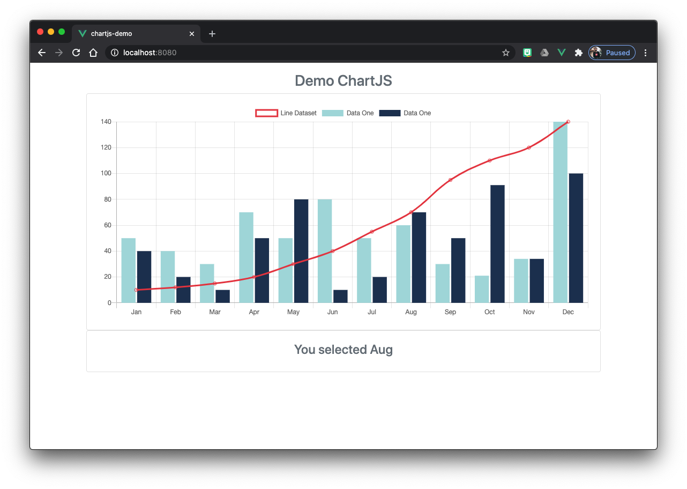

# chartjs-demo

This project uses chartjs to display charts as a component in a Vue application. This uses various Vue functionalities like mixins, event bus, various lifecycle hooks like `created()`.



## Project setup
```
npm install
```

### Compiles and hot-reloads for development
```
npm run serve
```

### Compiles and minifies for production
```
npm run build
```

### Lints and fixes files
```
npm run lint
```

### Customize configuration
See [Configuration Reference](https://cli.vuejs.org/config/).
